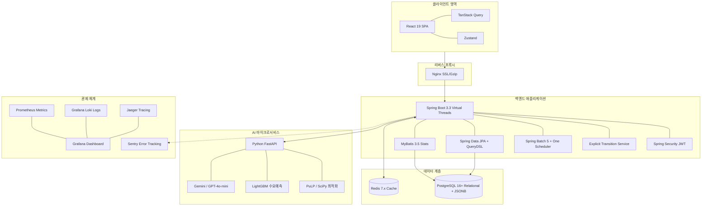

# 현대백화점 B2B AI 재고 수익 최적화 플랫폼 - 기술 스택 및 아키텍처 종합 명세서

## 1. 개요 및 목적
본 시스템은 현대백화점 B2B 재고 의사결정 및 수익 최적화 운영 플랫폼입니다. 1차 대상을 더현대 서울 직매입 악성재고로 지정하여, 보관비·폐기비·반품률·잠식효과를 종합 고려한 '증분 기여현감이익(Incremental Cash Margin)'을 극대화합니다.
더현대 서울 재고 담당자가 일반 전략을 승인·실행하는 주체이며, 본사는 예외 리스크 및 그룹 공동 프로모션 조정 역할을 담당합니다.

### 1.1 이 문서의 읽는 기준: 1개월 신규 전면 개발 생산 스택 (Ground-Up Production Architecture)

사용자 결정에 따라 기존 저장소의 구현 상태는 신규 구축의 기준으로 설정합니다. 이 문서는 **새로 구축할 React 기반 제품의 목표 아키텍처**를 기준으로 하며, “확정 선택”, “도입 후보”, “운영 조건을 확인한 뒤 결정할 항목”을 구분합니다.

| 구분 | 현재 확인된 상태 | 의미 |
| :--- | :--- | :--- |
| 프론트엔드 신규 스택 | React 19 + Vite + TypeScript + Tailwind CSS | 새 제품의 기본 선택. 기존 저장소 프레임워크와 무관 |
| 목표 백엔드/데이터 | Java 21 + Spring Boot, Python FastAPI, PostgreSQL, Redis | 실데이터 연동을 위한 목표 아키텍처 |
| 도입 예정 라이브러리 | TanStack Query, Zustand, 테이블/차트, 인증, 배치, 관제, ML/LLM | 의존성·운영요건·성능 검증 후 단계적으로 채택 |
| 설명 사이트 | Vite/Vinext 기반 별도 설명 사이트 | 제품 본체와 배포·의존성을 분리 |

따라서 아래 표에서 **확정**은 신규 개발의 기본값, **조건부**는 규모·보안·운영 요건을 확인한 뒤 채택할 항목입니다.

---

## 2. 영역별 기술 스택 상세 분석 및 트레이드오프 (Trade-off Matrix)

### 2.1 프론트엔드 (Frontend)
| 기술 스택 | 무엇을 하는가? (주요 역할 & 기능) | 핵심 장점 (Key Benefits) | 비교 대안 & 트레이드오프 |
| :--- | :--- | :--- | :--- |
| **React 19 + Vite + TypeScript (확정)** | B2B 오퍼레이션 타워 SPA 구축, 빠른 HMR·빌드, 클라이언트 시뮬레이션 인터랙션 | **vs Next.js** 내부 운영 도구는 SEO보다 번들·배포 단순성·API 분리가 중요하므로 Vite를 기본 선택 | SSR·서버 액션이 필요해지면 별도 BFF 또는 프레임워크 재검토 |
| **TanStack Query v5 (도입 예정)** | 실재고 API 캐싱, 상세진단 비동기 로딩, 전략생성 폴링 | **vs fetch 직접 관리** 서버 상태 캐시·무효화·재시도 정책을 표준화 | 현재 mock 데이터 단계에는 과함. API 계약 확정 후 도입 |
| **URL Search Params** | 층(2F~1F), 카테고리, D-Day 필터링 상태의 URL 연동 | **vs In-memory state** 새로고침, 뒤로가기, URL 링크 공유 시에도 필터 조건이 100% 유지됨 | URL 길이가 다소 길어질 수 있음 |
| **Zustand (도입 후보)** | 시뮬레이션 UI 상태와 다중 선택 상태를 화면 간 공유 | **vs React state** 상태가 여러 화면으로 확장될 때 selector 기반 구독을 선택적으로 사용 | 현재는 로컬 state로 동작한다. 먼저 서버 상태와 UI 상태를 분리한 뒤 채택 |
| **TanStack Table v8** | 수천 개 직매입 SKU 스티키 헤더, 컬럼 정렬, 다중 선택, 페이징 | **vs Basic Table / AG Grid** 가볍고 Headless하여 디자인 자유도가 높으며 초고속 가상화(Virtualization) 지원 | shadcn/ui와 조합하여 직접 스타일링 필요 |
| **Recharts** | 할인율 vs 증분이익 vs 예상 판매량 듀얼 축 차트, 위험도 스태킹 바 | **vs Chart.js / D3.js** React 컴포넌트 친화적이며 SVG 기반으로 듀얼 축 및 실시간 데이터 업데이트가 매끄러움 | D3 대비 대량 캔버스 연산 제약 존재 |
| **Tailwind CSS v4 + shadcn/ui (조건부 확정)** | 현대백화점 그린(#0F4C3A) 디자인 토큰, 모달, 상태 배지, 접근성 기본 컴포넌트 | **vs MUI/Styled Components** Vite와 조합해 번들·스타일 일관성을 확보하고, 필요한 컴포넌트만 소유 | Tailwind·shadcn 버전 고정과 디자인 토큰 관리 필요 |
| **React Hook Form + Zod** | 시뮬레이션 파라미터 조율 슬라이더 유효성 검증 및 폼 관리 | **vs Formik / Plain State** 비제어 컴포넌트 기반으로 폼 리렌더링 최소화 및 Zod 스키마 타입 안전성 제공 | Zod 스키마 정의 공수 필요 |
| **Web Vitals** | LCP < 1.2s, INP < 100ms 등 UX 성능 정량 관제 | **vs 측정 안 함** 슬라이더 조율 및 화면 렌더링 품질을 정량 관제 | 측정 스크립트 셋업 필요 |
| **테스트: TypeScript 단위 + Playwright E2E (도입 예정)** | 수식·시뮬레이션 회귀 테스트와 핵심 승인 흐름 검증 | **vs 도구 고정** 현재는 테스트 도구가 제품 코드에 확정되지 않았으므로 CI에서 실제로 유지할 최소 조합을 먼저 결정 | 도구를 늘리기보다 위험한 계산·승인 경로부터 테스트 |

### 2.2 백엔드 (Backend)
| 기술 스택 | 무엇을 하는가? (주요 역할 & 기능) | 핵심 장점 (Key Benefits) | 비교 대안 & 트레이드오프 |
| :--- | :--- | :--- | :--- |
| **Java 21 + Spring Boot 3.3** | RESTful API, 가상 스레드(Virtual Threads) 기반 동시 요청 고성능 처리 | **vs Node.js / Python** 대기업 엔터프라이즈 환경에서의 안정성, 멀티스레드 동시성, 풍부한 생태계 | Node.js 대비 초기 메모리 점유율 존재 |
| **Spring Data JPA + QueryDSL 5.x (목표)** | 도메인 CRUD 및 다중 조건 동적 필터링 검색 (컴파일 타임 안전성) | **vs Native SQL/jOOQ** 업무 조회는 QueryDSL, 대용량 집계는 검증된 read model 또는 SQL로 분리 | 현재 서버 모듈이 없으며, JPA와 SQL 매퍼를 동시에 도입하면 복잡도가 증가 |
| **MyBatis 3.5+** | 층별/카테고리별 손실 집계 리포트, Window Function/CTE 대용량 통계 SQL | **vs JPA 단독 사용** 복잡한 집계 SQL을 XML 원시 쿼리로 자유롭게 최적화하여 실행 계획 제어 | XML 매핑 파일 관리 필요 |
| **명시적 상태전이 서비스 (MVP) / State Machine (조건부)** | 위험탐지➔검토➔승인➔실행➔완료 상태와 허용 전이를 감사 가능하게 관리 | **vs State Machine 프레임워크** 상태가 고정된 초기 버전은 Enum·전이 서비스·낙관적 잠금으로 충분 | 병렬 승인·동적 전이가 늘어날 때만 State Machine 검토 |
| **Spring Security OAuth2/OIDC + RBAC (목표)** | 점포 담당자·본사 예외 담당자의 권한 분리 | **vs 직접 JWT 발급** 사내 IdP가 발급한 토큰을 Resource Server로 검증하고 브라우저 저장 위험을 줄임 | IdP·권한 매핑·감사 로그 설계 필요 |
| **Spring Batch 5 + 스케줄러 1종 선택 (목표)** | 재고 스냅샷·위험도 집계·재시도 가능한 배치 | **vs `@Scheduled`/Quartz/Kubernetes CronJob** 단일 인스턴스와 다중 인스턴스의 중복 실행 방지 요구를 먼저 정하고 하나를 선택 | Batch와 Quartz를 동시에 쓰면 운영 책임이 겹침 |
| **JUnit 5 + Mockito + Testcontainers** | 서비스 로직 및 Docker 기반 실 PostgreSQL/Redis 실전 통합 테스트 | **vs H2 메모리 DB** H2와 PostgreSQL 간 JSONB/SQL 차이 오류를 방지하고 실전 환경과 동일 검증 | Docker 기반 테스트 실행 시간 증가 |

### 2.3 데이터베이스 및 캐시 (Database & Cache)
| 기술 스택 | 무엇을 하는가? (주요 역할 & 기능) | 핵심 장점 (Key Benefits) | 비교 대안 & 트레이드오프 |
| :--- | :--- | :--- | :--- |
| **PostgreSQL 16+ (목표)** | 재고·판매·원가·승인 이력을 정규화 저장하고, 실행 파라미터·설명 payload만 JSONB로 보조 저장 | **vs MySQL/Oracle** 관계형 사실 데이터와 JSONB의 경계를 명확히 하여 조회·감사를 우선 | 파티션·인덱스·백업·보존기간을 함께 설계해야 함 |
| **Redis 7.x (선택적 캐시)** | 위험재고 집계·LLM 설명 캐시와 짧은 TTL 작업 상태 공유 | **vs 애플리케이션 메모리** 분산 캐시와 TTL을 제공하지만 원본 데이터 저장소가 아님 | 캐시 적중은 ‘0초’가 아니며 키 버전·무효화·stampede 방지가 필요 |

### 2.4 AI 및 수리 최적화 마이크로서비스 (AI Service)
| 기술 스택 | 무엇을 하는가? (주요 역할 & 기능) | 핵심 장점 (Key Benefits) | 비교 대안 & 트레이드오프 |
| :--- | :--- | :--- | :--- |
| **Python 3.11+ + FastAPI** | 수리 최적화 연산 및 ML 예측 전용 독립 마이크로서비스 | **vs Spring AI 단독** 파이썬 생태계의 머신러닝/수리 최적화 전용 라이브러리를 직접 활용 가능 | Spring Boot와의 HTTP 통신 제어 필요 |
| **OR-Tools/HiGHS 또는 PuLP + 명시적 solver (목표)** | 보관·폐기·할인·물류 제약을 포함한 증분 기여현금이익 최적화 | **vs SciPy 단독** 할인 단계·수량·채널 선택이 정수 제약이면 MILP solver가 필요하며, 결과는 모델·허용오차·입력 품질에 좌우됨 | ‘오차 없는 100% 정확’ 표현 금지. infeasible 처리와 solver 로그를 남겨야 함 |
| **scikit-learn/LightGBM + 시계열 검증 (목표)** | 판매량·소진율·가격 반응 추정 | **vs RAG/Vector DB** 정형 숫자 예측은 ML 회귀/시계열 모델의 대상이며, 할인 내생성·누수·불확실성 구간을 검증해야 함 | 과거 데이터 품질, 백테스트, 콜드스타트 보정이 필요 |
| **LLM Provider Adapter (OpenAI/Gemini/Ollama 등)** | 담당자에게 판단 근거와 실행 가이드를 설명하는 문장 생성 | **vs 특정 모델 고정** 모델명·가격·무료 한도는 변하므로 공급자 추상화와 버전 고정으로 교체 가능하게 함 | PII 마스킹, 구조화 출력 검증, 프롬프트 주입 방어, 토큰 예산·fallback 필요 |

### 2.5 관제, 모니터링, Sentry 및 품질 검증 (Observability & Testing)
| 기술 스택 | 무엇을 하는가? (주요 역할 & 기능) | 핵심 장점 (Key Benefits) | 비교 대안 & 트레이드오프 |
| :--- | :--- | :--- | :--- |
| **Sentry** | 프론트엔드/백엔드 실시간 런타임 에러 캡처 및 슬랙 알림 | **vs 로그 파일 직접 확인** 에러 발생 시 정확한 파일/라인 수, 콜스택, 사용자 동작 이력을 실시간 전달 | 무료 플랜 트래픽 한도 (월 5,000건) |
| **Prometheus + Grafana** | 서버 CPU, 메모리, DB 커넥션 풀, API RPS/Latency 실시간 시각화 관제 | **vs CloudWatch 의존** 무료 오픈소스로 가상 스레드 및 커넥션 풀 지표를 정밀 모니터링 | 프로메테우스 에이전트 셋업 필요 |
| **Loki + Promtail** | Logback JSON 로깅 수집 및 Grafana를 통한 중앙 로그 검색 | **vs ELK Stack** 엘라스틱서치 대비 메모리 사용량이 1/10 수준으로 매우 가볍고 직관적임 | 전체 텍스트 색인 기능은 단순함 |
| **OpenTelemetry + Jaeger** | React➔Spring Boot➔FastAPI➔PostgreSQL 구간 분산 트레이싱 추적 | **vs 로그 분리 관찰** 단일 TraceID로 서비스 간 병목 구간을 한눈에 식별 가능 | TraceID 전파 헤더 셋업 필요 |
| **k6 (목표)** | 승인·검색·시뮬레이션 API의 SLA에 따른 부하·회귀 측정 | **vs JMeter / Locust** 동시 사용자 500명은 임의 숫자가 아니라 실제 피크와 목표 SLO에서 산정 | P95/P99, 오류율, 비용/요청을 CI 기준으로 고정해야 함 |

---

## 3. AI 예측 정확도 & 퀄리티 극대화 4대 최적화 전략
1. **ML 특성 공학 (Feature Engineering) & 탄력성 곡선 보정**: 보관일수, 유통기한 D-Day, 과거 30/60/90일 판매 이동평균, 계절성, 할인율을 조합해 LightGBM 모델을 학습시킵니다. 할인율 상승 시 소진율 증가폭이 완만해지는 가격 탄력성 감쇄 곡선을 수학적으로 보정하여 현실적인 소진율을 추정합니다.
2. **신규/비인기 SKU 콜드스타트(Cold-Start) 방지**: 과거 판매 이력이 부족한 신규 상품은 '동일 브랜드 ➔ 동일 카테고리 ➔ 동일 가격대' 유사 상품의 탄력성을 가중 평균하여 예측값을 보완하고, 표본 부족 시 담당자에게 '신뢰도 65% 경고'를 표시합니다.
3. **LLM 구조화 출력(Structured Output) & 버전 캐시**: LLM 호출 시 JSON Schema 검증을 적용하고, 모델·프롬프트·데이터 버전이 포함된 키로 설명 결과를 캐싱합니다. 캐시 적중도 ‘0초’가 아니며 TTL·무효화·PII 마스킹·fallback을 함께 설계합니다.
4. **검증된 피드백 루프 (Closed-Loop Feedback System)**: 실제 실행 결과를 DB로 회수하여 예측 오차와 편향을 기록하고, 시간순 백테스트·승인·롤백 절차를 통과한 모델만 배포합니다. 검증 게이트 없는 자동 재학습은 실행하지 않습니다.

## 4. 구축 전에 반드시 고정할 운영 기준

기술 이름보다 아래 계약과 통제 항목이 재고 의사결정 품질과 AI 비용을 좌우합니다.

1. **데이터 계약·품질**: SKU·점포·소유권·원가·재고 스냅샷의 기준시각, 단위, 결측·중복·지연 처리와 입력 버전을 정의합니다.
2. **보안·승인·감사**: 사내 IdP/OIDC, 역할별 최소권한, 승인 전 가격 변경 금지, 추천·승인·실행 이벤트의 감사 로그를 고정합니다.
3. **모델 검증·안전장치**: 시간순 백테스트, 기준선 대비 증분이익, 신뢰구간·드리프트·infeasible·fallback, 사람 승인 조건을 정의합니다.
4. **비용·신뢰성 예산**: LLM 토큰·배치·DB·캐시 비용을 건당 추적하고 API timeout·재시도·멱등성·회로차단·백업·복구 목표를 설정합니다.

---

## 4. 종합 시스템 아키텍처 다이어그램

---

---

---

## 5. 최적화 연산 엔진 수학적 목적함수, 수요 예측 수식 및 AI 판단 규칙

현대백화점 AI 재고 처리 시스템(InventoryOS)의 최적화 연산 엔진(FastAPI + PuLP/HiGHS MILP Solver)에 실제로 탑재되는 핵심 수학적 목적함수와 ML 수요 예측 수식, 3대 AI 판단 규칙 명세입니다.

### 5.1 AI 핵심 목적함수: 증분 기여현금이익 ($M_{\text{inc}}$) 극대화
AI는 단순 겉보기 매출이 아니라, **AI 전략을 실행했을 때 최종적으로 현대백화점 통장에 남는 순현금**을 극대화하도록 계산합니다.

$$\max M_{\text{inc}} = \Delta R + S_{\text{disposal}} - C_{\text{cannibal}} - C_{\text{logistics}} - C_{\text{brand}} - C_{\text{return}} - C_{\text{AI\_case}}$$

**한글형 최종 의사결정식**

> 최종 선택 = 모든 하드 차단 조건을 통과한 대안 중 [추가 매출액 + 피한 폐기비용 − 정상판매 잠식손실 − 물류·재포장비 − 브랜드 훼손비용 − 반품·CS 충당금 − AI 1건 처리원가]가 가장 큰 대안

이 값이 양수인 대안만 수익성 후보가 됩니다. 여기서 `Q_sale`은 최종 이윤 자체가 아니라, 아래 수요 예측식으로 계산되어 `ΔR`과 폐기 회피액의 수량 입력으로 사용됩니다.

| 기호 | 변수/항목명 | 세부 산식 및 산출 방식 | 실무 반영 이유 및 의미 |
| :--- | :--- | :--- | :--- |
| $\Delta R$ | **증분 매출액** | $(P_{\text{sale}} \times Q_{\text{sale}}) - (P_{\text{base}} \times Q_{\text{base}})$ | 기준선(방치) 대비 할인가로 추가 판매하여 발생한 순증가 매출 |
| $S_{\text{disposal}}$ | **폐기물 처리비 회피액** | $\Delta Q_{\text{sojin}} \times \text{단당 폐기물 처리비}$ | 임박 재고를 소진함으로써 회피한 올바로 시스템 등록 및 특수 폐기비 수입 효과 |
| $C_{\text{cannibal}}$ | **정가 수요 잠식 손실** | $Q_{\text{sale}} \times \alpha_{\text{cannibal}} \times (P_{\text{정가}} - P_{\text{할인가}})$ | **할인 안 했어도 정가에 샀을 고객**($\alpha$)이 할인가로 구매하여 발생한 마진 손실 차감 |
| $C_{\text{logistics}}$ | **물류·재포장 비용** | $Q_{\text{sale}} \times (\text{수송비} + \text{스페셜 스티커/포장비})$ | 아울렛 이송 수송비, 매대 스티커 부착, 임직원몰 패키징 등 현장 발생 원가 |
| $C_{\text{brand}}$ | **브랜드 훼손 페널티** | $Q_{\text{sale}} \times P_{\text{정가}} \times \beta_{\text{channel}} \times \lambda_{\text{frequency}}$ | 공개 매대 파격 할인 시 **브랜드 가격 앵커링 훼손 감점** (앱 푸시/전용몰 이용 시 $\beta=0$으로 회피) |
| $C_{\text{return}}$ | **반품 및 CS 충당금** | $Q_{\text{sale}} \times r_{\text{return}} \times (P_{\text{할인가}} + \text{CS 처리비})$ | 소비기한 임박/이월 상품 구매 고객의 신선도 불만/반품 확률($r$)에 대비한 예비비 |
| $C_{\text{AI\_case}}$ | **AI 1건당 결정 원가** | $C_{\text{LLM}} + C_{\text{DATA}} + C_{\text{SEARCH}} + C_{\text{HUMAN}}$ | LLM 토큰비(8.5원) + DB인프라비(0.5원) + RAG비(1.2원) + 바이어 1분 검토비(250원) |

---

### 5.2 ML 수요 예측 및 소진율 감쇄 수식 ($Q_{\text{sale}}$)
할인율($d$)과 경과 시간($t$)에 따라 얼마만큼 팔릴지 추정하는 LightGBM 기반 수요예측 수식입니다.

$$Q_{\text{sale}}(d, t) = Q_{\text{base\_daily}} \times \left(1 + \varepsilon \cdot d\right) \times f_{\text{aging}}(t) \times \gamma_{\text{channel}}$$

**같은 수식을 한글로 읽는 방법**

> 예상 판매량 = 기준 일판매량 × (1 + 가격 탄력성 × 할인율) × 남은 기간 보정값 × 판매 채널 보정값

예를 들어 기준 일판매량이 10개, 가격 탄력성 계수가 2.5, 할인율이 35%, 남은 기간 보정값이 0.85, 채널 보정값이 1.3이면 `10 × (1 + 2.5 × 0.35) × 0.85 × 1.3 ≈ 30.1개`로 계산합니다. 실제 서비스에서는 카테고리·요일·재고·채널 데이터를 학습해 보정값을 산출하며, 이 결과를 최종 목적함수의 판매 수량으로 전달합니다.

* $Q_{\text{base\_daily}}$: 해당 SKU의 최근 30/60/90일 이동평균 일판매량
* $\varepsilon$: **가격 탄력성 계수** (할인율 1% 증가 시 수요 증가폭, 카테고리별 ML 학습)
* $f_{\text{aging}}(t)$: **D-Day 잔여 수명 감쇄 함수** (소비기한/시즌 경과에 따라 수요 반응도가 완만해지는 가격 탄력성 감쇄 곡선)
* $\gamma_{\text{channel}}$: **판매 채널 가중치** (현장 매대 1.0, H.Point 앱 푸시 1.3, 사내 임직원몰 0.8 등)

---

### 5.3 AI 최종 실행 판단 3대 규칙 (Decision Gate Rules)
FastAPI 최적화 엔진은 모든 대안을 위 수식에 넣은 뒤 아래 3가지 규칙에 따라 자동 분류합니다.

1. **규칙 1 (수익성 미달 차단)**: $M_{\text{inc}} \le C_{\text{AI\_case}}$ 이면 AI 대안을 기각하고 룰 기반 처리로 하강 (배보다 배꼽이 큰 개별 분석 방지).
2. **규칙 2 (AI 신뢰도 기반 패스트트랙)**: $M_{\text{inc}} > C_{\text{AI\_case}}$ 이고 **AI 신뢰도 $\ge 85\%$ & 재고 규모 $< 1,000\text{만 원}$** 이면 바이어 화면에 **'5초 원클릭 승인 추천'**으로 노출 ($C_{\text{HUMAN}}$ 인건비 극소화).
3. **규칙 3 (리스크 예외 라우팅)**: **재고 규모 $\ge 1,000\text{만 원}$ 또는 신뢰도 $< 85\%$** 인 고위험 재고는 본사 담당자 정밀 검토로 자동 라우팅.
