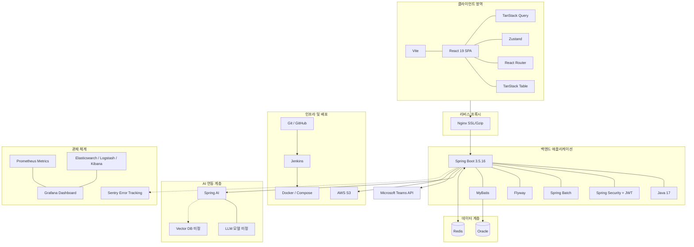

# 현대백화점그룹 3개 계열사 통합 AI 재고 의사결정 플랫폼 - 기술 스택 및 아키텍처 명세서

## 1. 개요 및 목적
본 시스템은 **현대웰니스, 현대리바트, 현대그린푸드**의 상품과 재고를 통합 관리하는 B2B 재고 의사결정 및 수익 최적화 운영 플랫폼입니다. 계열사별 보관 조건·판매 채널·처리기한과 검색·SNS 트렌드를 반영해 보관비·폐기비·반품률·정상판매 잠식효과를 종합 고려한 증분 기여현금이익(Incremental Cash Margin)을 최적화합니다.
일반 전략은 해당 계열사의 권한 있는 담당 MD가 승인·실행하며, 그룹 및 계열사 재고전략 담당자는 예외 리스크와 계열사 간 조정이 필요한 경우에만 개입합니다.

### 1.1 적용 범위와 스택 기준

- 3개 계열사의 상품·재고·판매·처리기한 데이터를 공통 모델로 통합하되, 계열사별 정책과 권한을 분리합니다.
- 계열사 간 재고 이동·공동 프로모션은 1차 데이터 품질과 승인 흐름을 검증한 뒤 P2로 확장합니다.
- 아래 기술 스택은 신규 운영 서비스의 목표 기준입니다. 현재 프로토타입의 프레임워크와 구현 상태는 별도로 마이그레이션합니다.

---

## 2. 영역별 기술 스택 상세 분석 및 트레이드오프 (Trade-off Matrix)

### 2.1 프론트엔드 (Frontend)
| 기술 스택 | 필요성 & 개발 기능 | 비교 대안 및 선택 이유 | 트레이드오프 (Trade-off) |
| :--- | :--- | :--- | :--- |
| **JavaScript + HTML/CSS** | 브라우저 기반 운영 화면과 접근 가능한 시맨틱 UI 구현 | **vs TypeScript 중심 구성** 초기 팀의 합의된 언어 범위와 빠른 화면 개발을 우선 | 런타임에서 타입 검증을 별도 보완해야 함 |
| **React 19** | 계열사 통합 대시보드·재고 테이블·승인 워크플로를 컴포넌트로 구성 | **vs 다중 프레임워크** 하나의 UI 모델로 계열사별 화면과 공통 컴포넌트를 재사용 | 클라이언트 번들 및 상태 설계 필요 |
| **Vite** | 개발 서버 HMR, 운영용 SPA 번들링 및 정적 자산 빌드 | **vs SSR 프레임워크** 내부 운영 서비스이므로 SEO보다 배포 단순성과 빠른 피드백을 우선 | SEO·서버 렌더링은 기본 제공하지 않음 |
| **Tailwind CSS + shadcn/ui** | 계열사 구분, 상태 배지, 테이블, 모달을 공통 디자인 토큰으로 구현 | **vs MUI/Styled Components** 필요한 컴포넌트만 소유하고 계열사별 테마를 일관되게 조정 | 유틸리티 클래스와 컴포넌트 토큰 관리 필요 |
| **TanStack Query** | 계열사별 재고 API 캐싱, 비동기 전략 생성, 재검증·무효화 처리 | **vs 직접 fetch 상태 관리** 서버 상태의 캐시·재시도·동기화 정책을 표준화 | 클라이언트 UI 상태와 분리해야 함 |
| **Zustand** | 필터, 선택 상품, 시뮬레이션 조정값 등 클라이언트 전역 상태 관리 | **vs Context API/Redux** 작은 스토어와 selector로 화면 간 상태를 명확히 공유 | 스토어 책임과 영속화 범위 관리 필요 |
| **React-Router (react-router-dom)** | 계열사·재고·전략·승인 화면의 SPA 라우팅과 보호 라우트 구성 | **vs 프레임워크 라우터** Vite SPA와 직접 결합하고 라우팅 정책을 명시적으로 관리 | 인증·권한 가드를 직접 설계해야 함 |
| **TanStack Table** | 대량 SKU 테이블의 정렬, 필터, 선택, 페이지네이션, 고정 헤더 | **vs 완제품 그리드** Headless 구조로 계열사별 컬럼과 접근성 UI를 직접 통제 | 가상화·스타일링을 별도 구현해야 함 |
| **pnpm** | 모노레포/프론트 패키지 의존성 설치와 잠금 파일 관리 | **vs npm/yarn** 디스크 효율과 빠른 설치, 엄격한 의존성 해석 | 팀·CI에서 pnpm 버전 고정 필요 |
| **Vitest** | JavaScript 단위·도메인 계산·상태 로직 회귀 테스트 | **vs Jest** Vite와 동일한 실행 환경으로 빠른 피드백 제공 | 브라우저 통합 테스트와 역할 분리 필요 |
| **Playwright** | 계열사 전환, 재고 조회, 시뮬레이션, 승인 핵심 흐름 E2E 검증 | **vs Cypress** 실제 브라우저·다중 엔진 테스트와 자동 대기 지원 | 테스트 데이터와 실행 시간이 필요 |

### 2.2 백엔드 (Backend)
| 기술 스택 | 무엇을 하는가? (주요 역할 & 기능) | 핵심 장점 (Key Benefits) | 비교 대안 & 트레이드오프 |
| :--- | :--- | :--- | :--- |
| **Java 17** | 엔터프라이즈 REST API와 배치 애플리케이션의 기준 런타임 | 장기 지원 버전과 조직 표준에 맞춘 안정적인 운영 | 최신 Java 기능 사용 범위는 17 기준으로 제한 |
| **Spring Boot 3.5.16** | 계열사·상품·재고·전략·승인 도메인 API와 트랜잭션 구성 | 자동 설정, 운영 생태계, 계층별 테스트 지원 | 버전 패치와 의존성 호환성 고정 필요 |
| **Spring Security + JWT** | 로그인, 토큰 검증, 계열사·점포·역할별 RBAC 및 API 보호 | 인증과 권한 정책을 애플리케이션 경계에서 일관되게 적용 | 토큰 만료·갱신·폐기와 브라우저 저장 정책을 별도 설계 |
| **MyBatis** | Oracle 조회·등록·복잡한 집계 SQL과 계열사별 데이터 매핑 | SQL을 직접 통제하고 계열사별 조회 차이를 명시적으로 관리 | 매퍼 XML/어노테이션과 SQL 회귀 테스트가 필요 |
| **Spring Batch** | 계열사별 재고 스냅샷, 판매 집계, 위험도 산출, 결과 회수 배치 | 대량 처리·재시작·실패 구간 관리 지원 | 배치 중복 실행과 계열사별 실행 순서 관리 필요 |
| **Flyway** | Oracle 스키마·인덱스·권한 변경을 버전 migration으로 관리 | 배포 환경 간 DB 변경 이력과 재현성 확보 | 운영 DB 변경 전 검토·백업·롤백 절차 필요 |
| **JUnit** | 서비스·매퍼·배치·승인 상태 전이 단위 테스트 | Java/Spring 표준 테스트 도구로 CI 연계가 쉬움 | Oracle 연동 통합 테스트는 별도 테스트 환경 필요 |

### 2.3 데이터베이스 및 캐시 (Database & Cache)
| 기술 스택 | 필요성 & 개발 기능 | 비교 대안 및 선택 이유 | 트레이드오프 (Trade-off) |
| :--- | :--- | :--- | :--- |
| **Oracle** | 3개 계열사의 상품·재고·판매·원가·승인 이력과 계열사별 정책 저장 | 조직 표준 RDBMS와 트랜잭션·권한·백업 체계 활용 | 스키마·인덱스·SQL이 Oracle 버전에 종속될 수 있음 |
| **Redis** | 위험재고 집계 캐시, 짧은 작업 상태, 반복 조회 데이터와 세션 보조 저장 | 빠른 TTL 캐시와 분산 환경 공유 지원 | 원본 데이터로 사용하지 않고 만료·무효화 정책 필요 |

### 2.4 AI 연동 (변경 가능)
| 기술 스택 | 필요성 & 개발 기능 | 비교 대안 및 선택 이유 | 트레이드오프 (Trade-off) |
| :--- | :--- | :--- | :--- |
| **Spring AI** | Spring Boot에서 LLM 호출, 프롬프트·구조화 출력·대화형 설명·임베딩 연동 | 백엔드 인증·감사·비용 추적과 AI 호출 경계를 한 애플리케이션에서 관리 | 모델 공급자와 기능별 API 차이를 어댑터로 흡수해야 함 |
| **LLM 모델: 미정** | 위험 원인 설명, 전략 후보 생성, 담당자용 실행 가이드 작성 | 품질·비용·보안·사내 반출 정책 검토 후 모델을 선택 | 모델 확정 전 토큰 비용·응답 품질·지연 목표를 가정하지 않음 |
| **Vector DB: 미정** | 상품 설명·정책·과거 사례 검색이 실제 요구로 확정될 때 도입 검토 | 검색 필요성과 데이터 규모를 확인한 뒤 Oracle 확장 또는 별도 제품을 비교 | 도입 전까지 벡터 검색을 필수 아키텍처로 전제하지 않음 |

### 2.5 외부 연동
| 기술 스택 | 필요성 & 개발 기능 | 비교 대안 및 선택 이유 | 트레이드오프 (Trade-off) |
| :--- | :--- | :--- | :--- |
| **Microsoft Teams API** | 승인된 전략·실행 조건·주의사항을 계열사별 담당 채널로 전달 | 담당자가 사용하는 협업 채널에서 후속 실행을 빠르게 공유 | API 권한·채널 매핑·재시도·중복 발송 방지 필요 |

### 2.6 인프라 및 배포
| 기술 스택 | 필요성 & 개발 기능 | 비교 대안 및 선택 이유 | 트레이드오프 (Trade-off) |
| :--- | :--- | :--- | :--- |
| **Docker / Docker Compose** | 프론트·백엔드·Redis·테스트 의존성의 로컬 및 검증 환경 표준화 | 개발·테스트 환경 차이를 줄이고 의존 서비스를 함께 기동 | 운영 오케스트레이션과 이미지 보안 검토 필요 |
| **Jenkins** | 빌드·단위 테스트·E2E·이미지 생성·배포 파이프라인 자동화 | 조직 CI/CD 표준과 승인 절차에 맞춘 단계별 배포 | 에이전트와 credential 관리 필요 |
| **Nginx** | 정적 프론트 자산 제공, reverse proxy, TLS·압축·라우팅 처리 | SPA와 Spring API의 진입점을 단일화 | 캐시·업로드 제한·WebSocket 정책을 명시해야 함 |
| **Git / GitHub** | 소스 형상관리, 리뷰, 브랜치·릴리스·이슈 추적 | 협업 이력과 변경 승인 절차를 표준화 | 보호 브랜치·권한·시크릿 스캔 설정 필요 |
| **AWS S3** | CSV·첨부파일·배치 산출물·감사 증빙의 객체 저장 | 대용량 파일의 애플리케이션 분리 저장 및 수명주기 관리 | 버킷 정책·암호화·보존·개인정보 접근 제어 필요 |
| **k6** | 계열사 전환·재고 조회·전략·승인 API의 부하·회귀 검증 | JavaScript 기반 시나리오와 CI 연계가 쉬움 | 목표 동시성·P95/P99·오류율을 별도 합의해야 함 |

### 2.7 관제 및 모니터링 (Observability)
| 기술 스택 | 필요성 & 개발 기능 | 비교 대안 및 선택 이유 | 트레이드오프 (Trade-off) |
| :--- | :--- | :--- | :--- |
| **Sentry** | 프론트·백엔드 런타임 오류, 사용자 흐름, 배포 버전별 오류 추적 | 스택트레이스와 재현 맥락을 한곳에서 확인 | 민감정보 마스킹과 이벤트 보존 기간 관리 필요 |
| **Elasticsearch / Logstash / Kibana (ELK)** | 애플리케이션·배치·Nginx 로그 수집, 검색, 대시보드화 | 로그 형식을 통합하고 계열사·요청 ID·오류 유형별로 분석 | 수집량·인덱스 보존·클러스터 자원 관리 필요 |
| **Prometheus + Grafana** | API 지연·오류율, JVM, 배치, Oracle·Redis, 인프라 지표 시각화 | 시계열 지표와 알림 기준을 코드로 관리 | exporter·scrape·알림 채널 구성이 필요 |

---

## 3. AI 적용 원칙과 검증 게이트
1. **계열사별 데이터 계약과 품질 점검**: 상품·재고·판매·원가·처리기한의 기준시각, 단위, 결측·중복·지연 여부를 계열사별로 검증한 뒤 AI 입력으로 사용합니다.
2. **구조화 출력과 근거 표시**: Spring AI 호출은 허용된 JSON 구조로 검증하고, 추천 근거·사용 데이터 기간·신뢰도·하방 경고를 함께 저장합니다.
3. **모델 교체 가능성 유지**: LLM 모델과 Vector DB는 아직 미정이므로 공급자 어댑터와 명시적인 fallback을 두고, 특정 모델·검색 엔진을 도메인 로직에 직접 결합하지 않습니다.
4. **사람 승인과 결과 피드백**: AI는 후보와 설명을 제시할 뿐 가격·수량·재고를 직접 변경하지 않습니다. 승인된 전략을 외부 판매·운영 시스템에 전달한 뒤 실제 판매·마진·잔여재고를 회수해 모델과 정책을 검증합니다.

---

## 4. 종합 시스템 아키텍처 다이어그램

